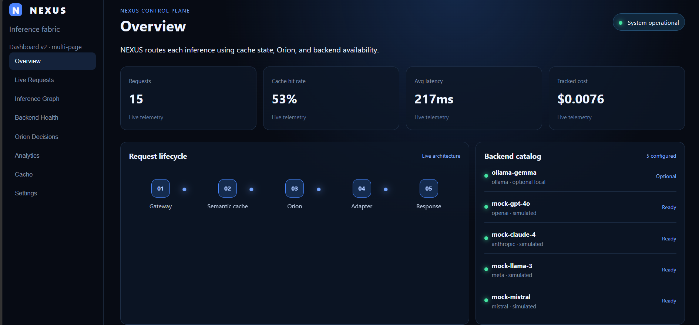
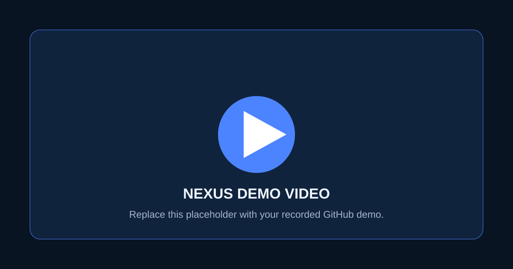

# NEXUS — Intelligent AI Inference Fabric

<p align="center"><strong>Learned, explainable routing for heterogeneous AI inference backends.</strong></p>

<p align="center">
  <a href="#quick-start">Quick start</a> · <a href="#architecture">Architecture</a> · <a href="#orion-routing-policy">Orion</a> · <a href="#api">API</a> · <a href="#demo">Demo</a>
</p>

> NEXUS is a portfolio-grade AI infrastructure project. Instead of sending every request to one model, it evaluates request context and routes inference toward the best available backend for quality, latency, and cost.

<!-- Dashboard screenshot. Keep the filename casing exactly as shown for GitHub. -->


## Why NEXUS?

Modern AI applications need more than a single model endpoint. They need a control plane that can balance quality, latency, cost, cache reuse, and backend availability.

NEXUS demonstrates that control plane with:

- **Orion**, a trained routing policy that predicts the preferred backend.
- Semantic caching to avoid repeated inference work.
- Adapter-based model integrations, including optional Ollama and realistic simulated providers.
- Live telemetry over REST and WebSocket.
- A React dashboard for routing, testing, cache inspection, and operational visibility.

## Highlights

| Capability | What it provides |
| --- | --- |
| Learned routing | Orion uses prompt size, estimated tokens, task, priority, and queue pressure. |
| Explainability | Every decision returns backend, confidence, rationale, and alternatives. |
| Semantic cache | Reuses similar same-task requests through embeddings and cosine similarity. |
| Backend adapters | Ollama/Gemma is optional; GPT-4o, Claude, Llama, and Mistral are simulated for offline demos. |
| Observability | Request IDs, JSON logs, live events, aggregate metrics, and dashboard views. |
| Local-first | Run the complete demo without Docker, API keys, or Ollama. |

## Architecture

```text
React dashboard
      │ REST + WebSocket
      ▼
FastAPI gateway ── request ID + structured logs
      │
      ▼
Semantic cache ── cache hit → immediate response
      │ miss
      ▼
Orion learned routing policy
      │
      ▼
Adapter registry ── Ollama (optional) | simulated providers
      │
      ▼
Inference response ── telemetry → dashboard live stream
```

For Docker deployments, PostgreSQL/pgvector and Redis are included as infrastructure services. The no-Docker demo uses an in-memory semantic cache so you can run everything locally.

## Quick start

### Recommended: local demo without Docker

Prerequisites: **Python 3.10+**, **Node.js 20+**, and npm.

```powershell
git clone https://github.com/KrupalUpadhyay/NEXUS-Intelligent-AI-Inference-Fabric.git
cd NEXUS-Intelligent-AI-Inference-Fabric

cd backend
python -m pip install -r requirements-dev.txt
cd ..\frontend
npm install
cd ..

python run.py
```

Open **http://localhost:5174**. The launcher starts the FastAPI API and React dashboard, then opens the dashboard in your browser. Press `Ctrl+C` in the launcher terminal to stop both services.

Ollama is optional. Without it, NEXUS uses simulated provider adapters and Orion normally.

### Docker Compose

Prerequisite: Docker Desktop.

```powershell
docker compose up --build
```

- Dashboard: http://localhost:5173
- API documentation: http://localhost:8000/docs
- Health endpoint: http://localhost:8000/api/v1/health

If a package download times out during the first Docker build, run `docker compose build api` again and then `docker compose up`.

## Using the dashboard

1. Open **Overview** for live metrics, architecture, backend catalog, and a quick inference panel.
2. Open **Orion Decisions** for full routing controls.
3. Enter a prompt and choose a task type.
4. Keep **Orion auto-route** selected to use the trained routing policy, or choose a simulated backend explicitly.
5. Adjust **priority** and **queue length** to see routing behavior change with operating conditions.
6. Submit the exact same request twice to demonstrate a semantic-cache hit.

The dashboard has dedicated pages for Live Requests, Inference Graph, Backend Health, Analytics, Cache, and Settings.

## Orion routing policy

Orion is a supervised learned policy, not a hard-coded task router. Its serving features are:

- task type
- prompt length
- estimated tokens
- requested output tokens
- user priority
- queue length

The current artifact was trained from **5,000 synthetic requests** and **20,000 backend benchmark observations**. The benchmark models backend-specific quality, cost, output scaling, and queue-pressure behavior. This makes Orion suitable for a controlled demo; production use would require real traffic, real backend measurements, and quality feedback.

Retrain Orion:

```powershell
python training/generate_synthetic_workload.py --count 5000 --seed 73
python training/benchmark_backends.py
python training/train_orion.py
```

The model artifact is saved to `backend/models/orion_policy.joblib`.

## API

### Health

```http
GET /api/v1/health
```

### List configured backends

```http
GET /api/v1/models
```

### Submit inference

```http
POST /api/v1/infer
Content-Type: application/json
```

```json
{
  "prompt": "Design a scalable AI inference routing platform.",
  "task_type": "reasoning",
  "max_tokens": 256,
  "user_priority": 7,
  "metadata": { "queue_length": "12" }
}
```

Example response fields:

```json
{
  "status": "completed",
  "cached": false,
  "output": "...",
  "latency_ms": 542.0,
  "estimated_cost_usd": 0.003108,
  "quality_score": 0.88,
  "routing": {
    "selected_backend": "mock-gpt-4o",
    "confidence": 0.93,
    "reason": ["Orion selected a backend from the learned benchmark policy."],
    "alternatives": ["..."]
  }
}
```

### Metrics and live updates

```http
GET /api/v1/metrics
WS  /api/v1/live
```

## Testing

Run backend tests from the repository root:

```powershell
python -m pytest
```

Build and type-check the dashboard:

```powershell
cd frontend
npm run build
```

See the complete [test and recording plan](docs/test-and-record-plan.md).

## Repository layout

```text
backend/
  app/             API, telemetry, cache, adapters, Orion, and services
  models/          Serialized Orion artifact
  tests/           API, cache, adapter, telemetry, and policy tests
frontend/          React + TypeScript control-plane dashboard
training/          Workload generation, benchmarking, and Orion training
docker/            API, frontend, and Nginx container definitions
docs/              Phase notes, test plan, and demo checklist
run.py             One-command local launcher
```

## Demo

<!-- TODO: Replace this with a hosted GIF or a video thumbnail. -->
[](https://github.com/KrupalUpadhyay/NEXUS-Intelligent-AI-Inference-Fabric)

Suggested demo sequence:

1. Start NEXUS with `python run.py`.
2. Show Orion auto-routing a request from the dashboard.
3. Change priority and queue length while keeping the prompt/task stable.
4. Demonstrate explicit adapter selection.
5. Repeat a request to show a semantic-cache hit.
6. Show live requests and analytics updating without a refresh.
7. Finish with passing tests.

Use [demo-checklist.md](docs/demo-checklist.md) and [test-and-record-plan.md](docs/test-and-record-plan.md) while recording.

## Current status

All planned Phases 1–10 are implemented:

- FastAPI gateway, Docker, React foundation
- Configuration, logging, request middleware, persistence boundaries
- Typed inference API and orchestration service
- Semantic cache and pgvector-ready persistence
- Adapter pattern with optional Ollama and simulated providers
- Synthetic workloads and backend benchmarks
- Orion learned routing policy
- Live dashboard, WebSocket telemetry, and animations
- Tests, documentation, and local launcher

## Limitations and next steps

- Simulated providers are intentionally used for cost-free, repeatable demos; real provider SDK adapters are a natural next step.
- The current telemetry service is process-local for the demo. Redis pub/sub and persisted analytics are the production upgrade path.
- Orion’s current evaluation is synthetic. Production retraining should use anonymized traffic, backend health, observed latency/cost, and human quality feedback.

## License

Add a license file before distributing or reusing this project publicly.
